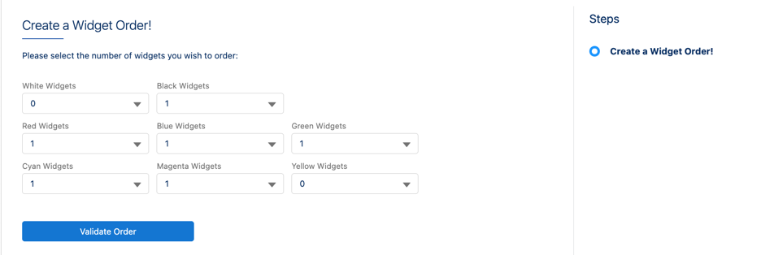
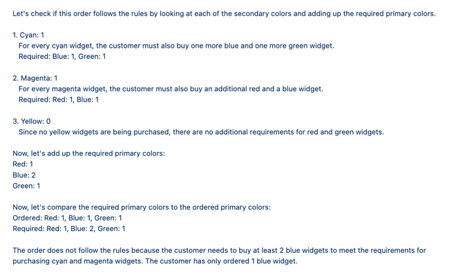

# ChatCPQ

This demonstrates a simplistic CPQ running on ChatGPT.    The rules are thus:

- Widgets come in black, white, red, blue, green, cyan, yellow, and magenta.
- You are free to order as many cyan, yellow, and magenta widgets as you like, but for each one, you must also buy two primary colored widgets: cyan=blue+green, magenta=blue+red, yellow=red+green
- You are free to order as many additional primary colored widgets as you like above the minimum required by the secondary colored ones.
- You can buy as many black and white widgets as you like.

## Installation

The demo consists of an OmniScript and a "service definition" JSON file.  

The OmniScript needs to be imported into your environment (pick either the *ChatCPQ OmniStudio.json* or *ChatCPQ Vlocity.json* file depending upon the namespace used in your org) but do not activate it.

For the service definition file, you will need to create a new static resource called ChatCPQ and upload the file ChatCPQ_service.json to it.

Apart from that, you will need to have a named credential called "OpenAI" for the code to work.

## Running the Demo

When you run the OmniScript, you are presented a screen like this:

You can pick the quantities you wish to test, or there's a demo button (not shown) that you can click as well.  When the quantities are right, press Validate Order. It is typical that it can take up to a minute for the response to occur.  When it does, you should see something like:

## Demo Notes

Here are some things to notice:

- The templates used in this demo are contained in the service definition file you uploaded as a static resource
- The Valid Order button is a remote action which calls the LLMkit and indicates which service definition to use.
- This is not extensively tested, and may produce incorrect answers if stressed.  Take that as a challenge to improve the prompts if you like.

