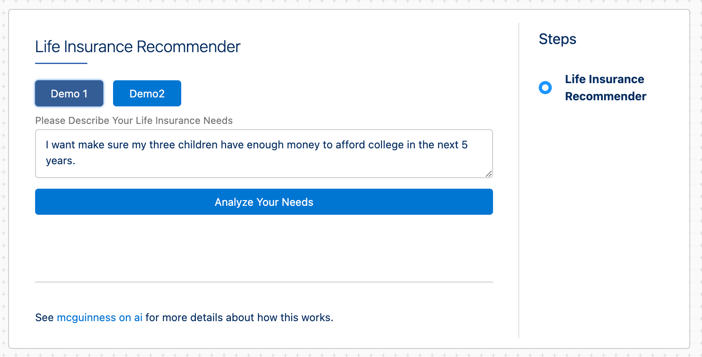
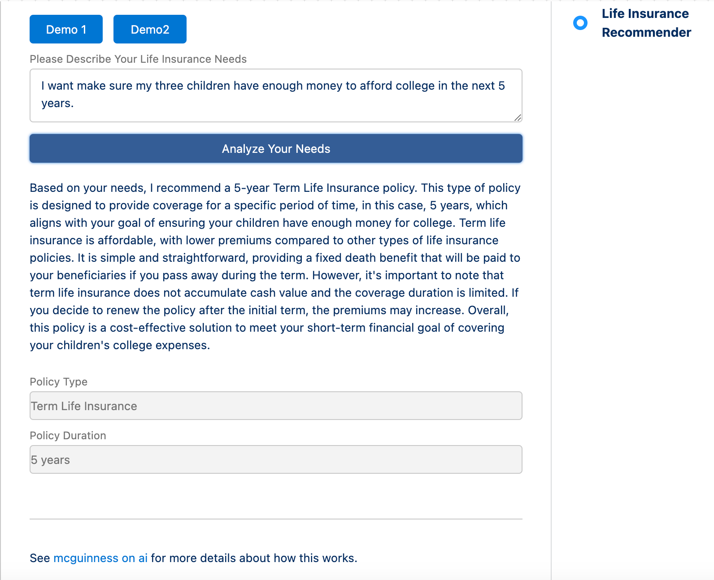

# Life Insurance Recommender

This demonstration was designed to illustrate a couple of concepts:

1. The System prompt asks for a response not as free text, but in a JSON structure that is defined by the prompt.
2. It demonstrates that you can use GPT's "knowledge" to perform a "zero-shot" analysis

The basic flow of the demo is that a user types in an explanation for why they think they need Life Insurance, and the system responds with a specific recommendation.

## Installation

The demo consists of an OmniScript and a "service definition" JSON file.  

The OmniScript needs to be imported into your environment (pick either the *Life Ins Recommender OmniStudio.json* or *Life Ins Recommender Vlocity.json* file depending upon the namespace used in your org) but do not activate it.

For the service definition file, you will need to create a new static resource called LifeInsService and upload the file LifeInsService.json to it.

Apart from that, you will need to have a named credential called "OpenAI" for the code to work.

## Running the Demo

When you run the OmniScript, you are presented a screen like this:

You can enter any text you like or pick one of two Demo texts to populate the text box.  Press Analyze Your Needs to see the response:

## Demo Notes

Here are some things to notice:

- The templates used in this demo are contained in the service definition file you uploaded as a static resource
- The Analyze Your Needs button is a remote action which calls the LLMkit and indicates which service definition to use.
- This is not extensively tested, and may produce incorrect answers if stressed.  Take that as a challenge to improve the prompts if you like.
- The reponse is parsed as JSON before it is returned to the OmniScript, which is how the answer shows up in multiple (and correct) fields.  The service definition file is where the instruction to parse the results is given.

