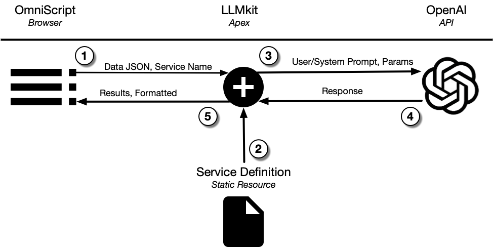
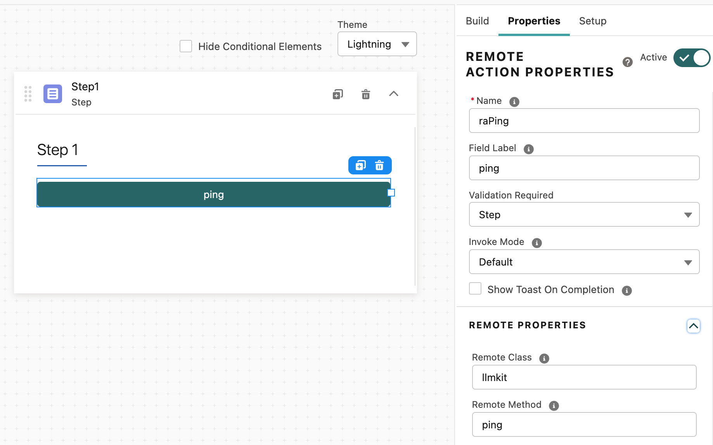
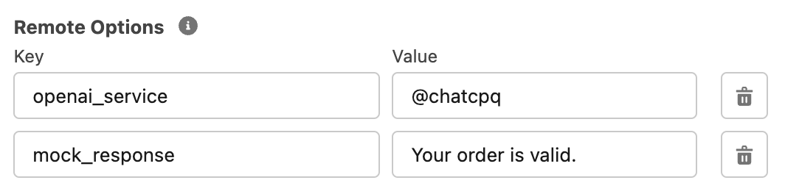

# LLMkit Documentation
*A library for making it easy for Salesforce's OmniStudio to call GPT*


There are three sources of information on how this library works.  In order from most authoritative to least, they are:

1. The source to LLMkit.cls, which is the actual implementation
2. The source to LLMkitTest.cls, which is the test class for LLMkit.cls, and has working examples of exercising the class
3. [Demonstrations](../Demos)
4. This README

That is  the inverse of the order of readability, however.


## Philosophy

Rather than building a series of specific, one-off interfaces to OpenAI, the class provides a completely generic, parameter driven interface that does a lot of the heavy lifting for you.  It supports the notion of bundling the parameters into a "service" (for example, a life insurance recommender) that can be re-used and shared.  The users of the service need not know how the service works (although it's not hidden) to get the benefit from it.

The definition of a service consists of:

- Template(s) for buiding prompts; the templates are used to merge live data into the prompts at runtime.
- Settings for OpenAI models like model, temperature, max_tokens
- Instructions on how to handle the response

The motivation for this is that it takes a fair amount of effort to write, test, and refine prompts for LLMs, and prompt engineering is likely to require a different skill set than writing OmniScripts, so it makes sense to separate that out from building UI flows.


In general, the deployment-time flow will look like this:

------




1. The OmniScript call the class, passing the current, in-flight data (the Data JSON as it's called) for the input and the name of the service as an option.
2. The LLMkit class reads in the specification of the service from static resources and, optionally, retrieves the specified templates as well.  It then merges the input data into the templates to product the final prompts.
3. The prompts and other parameters are sent as part of the call to OpenAI's API
4. OpenAI's API responds
5. Using the post processing instructions given in the service definition, LLMkit returns the results to the OmniScript

------


## Installation

There are two .cls files to install. It's easiet to upload them as well in the Setup section of the web UI. Start by going to Setup, search for "classes", and click on Apex Classes. 

From there you'll have a list of Apex classes.  Hiding in the top of the list is a button labeled "New".  Press it, and you are taken to an Apex Editor.  Now, copy the contents of LLMkit.cls (all ~800 lines of it), and paste it into the editor.  Press Save.

Repeat the same thing for the over 300 lines of LLMkitTest.cls.  

Once you've loaded it, you can go to Class Summary and run the test. You now have access to the LLM kit from OmniScript (and Apex and ...) and have a test class with high-80s% coverage if you wish to deploy it to production.


## Calling Pattern

The class is named "LLMkit", and it follows the OmniStudio (aka Vlocity) Open Interface standard.  If you're not used to it, it represents a very different approach from standard Apex classes.  In general technical terms, it implements a "late-binding" approach: the method we want to call is passed in as a string.  The class finds the method for you at runtime (late) rather than the normal Apex way, at compile time (early).

This makes it very easy to call from OmniScript, but a bit harder to call from "normal" Apex.  The copious examples in the test class, however, should suffice to demonstrate how to call the methods from Apex directly (it's just a bit of additional overhead).

Here's an example of calling the "ping" interface from OmniScript:



You can see down at the bottom right that we just tell it the remote class is "llmkit" and the method is "ping".  Automatically, there are three "inputs" passed along with the name of the method.  The three are called "input", "ouput", and "options".  (We'll see more about them in the other methods.) When calling from OmniScript or Integration Procedures, this is implicit in the UI that allows you to specify your call.  From Apex, it's a bit messier.  Here's a snippet of Apex from the test class that demonstrates how calls work:

```APEX
Map<String,Map<String,Object>> args = new Map<String,Map<String,Object>>();
args.put('input',new Map<String,Object>());
args.put('output',new Map<String,Object>());
args.put('options',new Map<String,Object>());

LLMkit llmkit = new LLMkit();
llmkit.call('ping', args);

String response = (String) (args.get('output').get('response'));
```

Generally speaking, the test  class contains many useful (if somewhat artificial) examples of calling the OpenAIkit class from APEX and should be sufficient to get you going.


## Methods Supported

There are three callable methods:

| Method            | Description                                                  |
| ----------------- | ------------------------------------------------------------ |
| ping              | Just returns "pong", but slightly useful to check to see if you can call the class during installation.  See the test class for an example of how it works. |
| generate_template | You pass it in your data, a template (or the name of a static resource file that holds the template), and it inserts the data into the template and returns the results to you. |
| call_openai       | This takes your data, populates the prompt(s), sends it off to OpenAI, patiently (very patiently) awaits a reply and then sends it to you. |


------

### Method: ping

Only useful as a quick test to see if the class is available.  Has no inputs, returns in output a "response" property with the value "pong".

To call from Apex see the method `test_ping()` in the test class.

| Method Name | ping               |
| ----------- | ------------------ |
| options     | *not used*         |
| input       | *not used*         |
| output      | response == "pong" |


------

### Method: generate_template

This will take a template specified in *options* (see below for format) and populate it with data out of *input*.  The resulting template is returned in *response* as a string.

To call generate_template from Apex, see the method `test_generate_template_good()` in the test class.

| Method Name | generate_template                                            |
| ----------- | ------------------------------------------------------------ |
| options     | *template* is either the template, or starts with '@' and is the name of a static resource that holds a template. |
| input       | The source of data used to populate the template.  With OmniScript, this is typically just the "Data JSON" which is sent automatically and contains all the in-flight data of the OmniScript. |
| output      | *response* will be a string containing the populated template if successful..<br />*error* will hold an error message of something goes wrong.  It does not exist on success. |

Note that the *template* can either be a template literal (that is, just the text of the template) or start with an '@' character followed immediately (no space) with the name of a static resource (without its extension).  In the second case, the template generator will read in the static resource and use its contents.  This allows you to build up a library of prompt templates, if you wish, and re-use them for multiple purposes.


#### Template Format

The template format is a very simplified version of the Jinja2 templating system used by Python.  This is so that you can develop templates using a Python tool such as [this Google Colab notebook](https://colab.research.google.com/drive/1Cc0aev-Ro9atCsYiH_d0VhgjVHNPzrL2?usp=sharing) and them use them in Salesforce. In general, the text of the template is copied verbatim except when one of these three is encountered:

- {{ which is the start of an insertion of data, followed by }}
- 
- {# which indicates a comment that is not included in the output, followed by #}

The insertion of data uses a standard "." notation (and so NOT the OmniScript ":" notation) to traverse a data structure.  For arrays, you can use array.0, array.1, etc. to refer to members, although it is expected that you will use a  loop almost always instead.

The control logic supports the following:

- 
- 
- 
- 
- 


For the  statement, the class looks to see if:

- *variable* exists
- When turned into a string, it does not equal "false" (case insensitve comparison)
- When turned into a string, it does not equal "0"

If all those are true, the variable is declared to be *true*.

 and  work as expected.

Important limitations:

- ***You cannot have nested ifs.*** That's a future feature.
- ***You cannot have expressions in your if's test.*** That's a distant future feature


For the  statement, it is designed to simply iterate over an array.

Important limitations:

- ***At this point in time, you cannot have nested fors.*** That's a future feature


However, you can have a *for* inside an *if*, or an *if* inside a *for*, but you cannot do anything more complicated that that yet.


##### Template Example

This is an example used in the unit test *test_generate_template_logic* from the test class:

| Input (Data JSON)                                            | Template                                                     |
| ------------------------------------------------------------ | ------------------------------------------------------------ |
| {<br>   "a": 0,<br>   "b": 1,<br>   "bdata": [<br>     10,<br>     11,<br>     12<br>   }<br>} |  a is non-zero <br>bdata is {{ i }},  |

This generates:

`bdata is 10, 11, 12, `

 

------

### Method: call_openai

This is the most important method, and therefore the most complicated.

The starting point is that it will send your inputs to OpenAI's "completion" interfaces and return the result to you.  There's tremendous variability in how you do that and how the response gets handled.  Much of the variability is there to make development a bit easier or testing work.

Let's start with the inputs to call_openai.  When you are calling from OmniScript, the inputs are split into two bit buckets:

1. input, which holds either the entire in-flight data from your OmniScript at the point you make the call to LLMkit (this is the default), or some edited subset of that data that you've chosen (not default).  In this documentation, we assume you've just sent the whole kit and caboodle of data, but it makes no real difference to the method.
2. options, which instruct the class on how to pre-process the data, call OpenAI, and post-process the results.

There's not much to say about the input (and what there is to say is mostly covered in the documentation for generate_template).

#### Options

Here are the options that affect the call.  They will be further discussed after the table.

| Option                                          | Required? | Description                                                  |
| ----------------------------------------------- | --------- | ------------------------------------------------------------ |
| openai_service                                  | N         | Specifies a second source of options.  Follows the '@' syntax (see below) |
| model                                           | Y         | Which OpenAI model are you using (e.g., gpt-4, text-divinci-003) |
| named_credential                                | Y*        | The named credential used to provide the API key to OpenAI.  Either this or api_key must be specified. |
| api_key                                         | Y*        | The actual, sk-..., OpenAI key you'll use instead of a named credential |
| system_template, user_template, prompt_template | Y         | If you are calling a chat model (gpt-4, gpt-3.5-turbo), you need a system_template and a user_template.  Otherwise you need just a prompt_template.  All templates follow the '@' syntax. |
| temperature                                     | N         | The temperature setting for OpenAI.                          |
| max_tokens                                      | N         | The max_tokens setting for OpenAI                            |
| timeout                                         | N         | How long Salesforce will await a response.  Defaults to 120000 milliseconds, which is the maximum allowed. |
| mock_response                                   | N         | If provided, this is used as the result and the actual call to OpenAI is not made.  Useful for testing and demos. |
| raw_response                                    | N         | Normally, the text response from OpenAI is fished out of the JSON structure which the REST calls return.  If this is provided and is true, the entire return from OpenAI will be returned from the method. |
| json_response                                   | N         | If you expect that the response from OpenAI is going to be a JSON structure rather than just text (that is, your prompts tell OpenAI to return JSON), including this option and setting it to true will cause the method to convert the string to JSON so you get a data structure back instead of a string. |


##### @ Syntax

The options openai_service, system_template, user_template, prompt_template, and mock_response allows you to either include a literal string or the name of a static resource to fetch the value from.  If the first character is an '@', then the rest of the option is taken as the name of a static resource that will be read and used.  Here's an example that shows one of each style:



In this case, the service definition is coming from a static resource called chatcpq, but the literal text "Your order is valid." will be used as the mock response.


##### openai_service

While you can provide all the options directly to make a call to OpenAI, the intent (see Philosophy) is that you will put them together into a service specification.  A service's specification is a JSON structure, which holds all of the parameters and options needed to call a service (but not the input data, of course).  While you can pass in a complete service specification as an option to the call, it is normal to keep the service specification in a static resource.  There are samples provided in the [Demos](../Demos) subdirectory of this repository.

The logic of the class is that it will first look for the value of an option in the directly passed in values and, if not found, then look in the service definition.  This allows you to use a service definition but override values in it (or add things, like the mock_response in the image above).

##### model

Specifies the name of the model, using the same naming convention that OpenAI uses.  Note that if OpenAI adds new models, the source to the class will need to be updated.  The name of the model is used to determine what the calling convention is (chat or not).

##### named_credential, api_key

All calls to OpenAI require a API key. The best way to do that, in Salesforce, is to used a Named Credential.  If you are not familiar with Named Credentials, you can see my [newsletter article](https://mcguinnessai.substack.com/p/fixing-the-one-glaring-problem-so) on the topic.  As an alternative, and although I discourage it, is to supply the api_key you'll use directly.  One of the two must be present.

##### system_template, user_template, prompt_template

These are the templates that will be sent to OpenAI as your prompts.  system_template, user_template are both required if you're calling gpt-4 or gpt-3.5-turbo, and just prompt_template is required for older models.  These follow the @ syntax, so they can be specified directly or as static resources.  Note, however, in OmniScript, it is nearly impossible to pass literal templates if you are using any logic in your templates, as OmniScript will delete anything between matching %s.  That problem does not happen if the template is embedded in the service defition, fortunately.

##### temperature, max_tokens

These is passed directly to OpenAI. Refer to [their documentation](https://platform.openai.com/docs/api-reference/chat/create) for an explanation of the values.

##### timeout

Salesforce has a default timeout of 10 seconds for REST calls, which is way too short.  The library replaces that with a default timeout of 120 seconds, the maximum.  If you have a reason for something different, specify it here, in milliseconds.

##### mock_response

If you specify this parameter, the call will *not* make an actual call to OpenAI; instead, it will pretend this was the content of the response from a fake call.  This is useful if you are working on other aspects of your integration and don't need to make endless calls, you want your demos to work quickly, or are building test classes.  This follows the @ syntax, so you can either give a string or the name of a static resource that holds your mock response.

##### raw_response

OpenAI returns a JSON structure containing all sorts of information, including the text of the response.  Normally, we just fish the text out of the JSON structure and return "response" set to that in the output.  Additionally, we return an output of "raw_response" that contains the full response from OpenAI.  Passing in this option with a value that's true will cause response to hold the full response too.

##### json_response

With clever prompt engineering, you can get OpenAI to return not merely a text response, but a structured JSON object that has a more complicated response.  OmniScript is not great at handling strings with JSON data in them, however, and normally you have to either use a DataRaptor or custom code to turn the string into proper data.  If you include this option in your call, the response from OpenAI will be deserialized back to a real data structure, avoiding additional work for the OmniScript.

#### Return from call_openai

The method returns, in output:

| Key             | Value                                                        |
| --------------- | ------------------------------------------------------------ |
| elapsed_seconds | How long, in seconds, it took to call OpenAI and get a response |
| raw_response    | A string holding the body of the response from OpenAI.  This would need to be deserialized most likely for further use, but it's intended mostly as a debugging. |
| response        | The response from OpenAI.  Absent the options raw_response and json_response, it's just the text of the response.  With json_response, it's deserialized into a data structure (error if not deserializable).  With raw_response, it's the same data as in raw_response except deserialized – that is, the entire response from OpenAI in a parsed structure. |
| error           | Rut-roh, something bad happened.                             |


